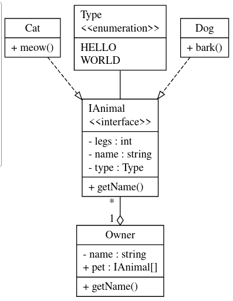

# YouML
Build UML diagrams quickly

```
Owner
- string name
+ getName()
+ IAnimal[] pet

IAnimal
- int legs
- string name 
- Type type
+ getName()

Dog : IAnimal
+ void bark()

Cat : IAnimal
+ void meow()

Type
: HELLO
: WORLD
```
